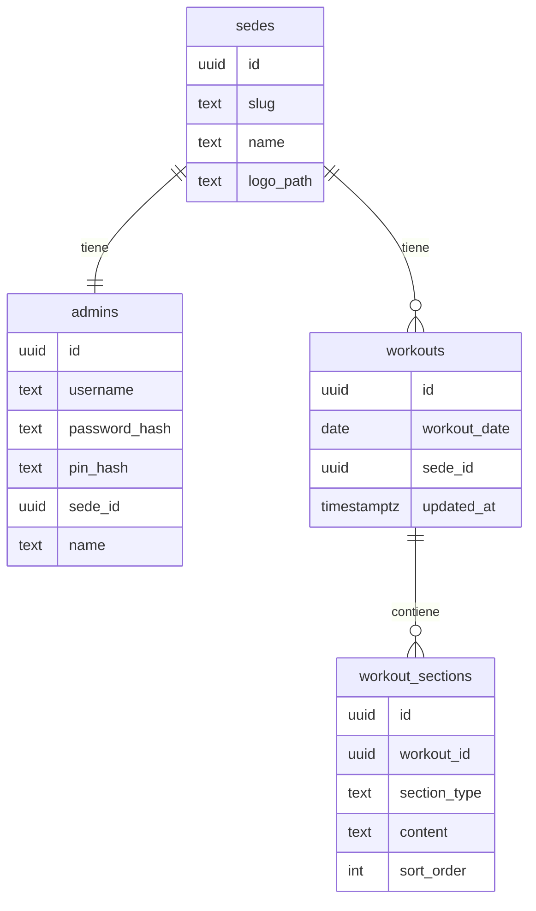

# Plan: Plataforma de visualización de entrenamiento

## Stack (decisión)

**Next.js (App Router) + TypeScript + Tailwind + Supabase (Postgres) + Vercel** es el encaje correcto: un solo deploy, SSR/middleware para sesiones, y Postgres con RLS. No hace falta otro framework.

- Auth **custom** (no email de Supabase Auth): usuarios tipo Instagram, alfanuméricos, seed manual.
- Zona horaria fija: `America/Bogota` para “día actual”.
- Sedes fijas: Gym 1 y Gym 2 con logos por defecto en `/public`.

## Modelo de dominio



- **Constraint:** `UNIQUE (workout_date, sede_id)` — un WOD por sede por día.
- **Secciones:** solo se insertan las activas (`calentamiento`, `fuerza`, `accesorios`, `conditioning`, `skills`); contenido texto plano.
- **Admin por sede:** el login con clave abre el panel **scoped a su sede** (crea/edita/elimina solo WODs de esa sede). El selector “¿para qué sedes?” del MD original se simplifica: al haber 1 admin/sede, el WOD siempre aplica a la sede del admin logueado.
- **PIN:** mismo admin; al validar PIN → sesión de **solo lectura** anclada a `sede_id` del admin (sin preguntar sede: ya está implícita).

## Auth y sesiones

| Flujo | Credenciales | Resultado |
|-------|--------------|-----------|
| Admin | `username` + `clave` | Cookie httpOnly, `role=admin`, `sedeId` |
| Lectura (TV) | PIN | Cookie httpOnly, `role=viewer`, `sedeId` |

- Passwords y PINs con **bcrypt** (o argon2); PIN hasheado, nunca en claro.
- Sesión con JWT firmado en cookie httpOnly (`jose` o iron-session), validada en middleware.
- Rutas: `/login`, `/admin/*` (solo admin), `/display` (solo viewer), logout en ambos modos.
- Seed SQL/script: 2 sedes + 2 admins (credenciales documentadas en `.env.example`, no en repo).

## Pantallas

1. **Login** — Usuario + clave + Ingresar; abajo “Ingresar con PIN” intercambia a campo PIN + Ingresar.
2. **Admin**
   - Lista/calendario de WODs de su sede.
   - Crear: fecha → checkboxes de secciones → textareas largos solo para las activas → guardar.
   - Editar / eliminar con **diálogo de confirmación**.
3. **Lectura (TV)**
   - WOD del día (Bogotá) de su sede.
   - Una sección = una “página”; navegación izquierda/derecha (click + teclado/flechas).
   - Títulos de sección destacados; tipografía grande; texto largo en **2 columnas equilibradas** (reparto simétrico de líneas).
   - Esquina inferior izquierda: “Secciones activas” + contador.
   - Cerrar sesión visible.
4. **Responsive:** admin pensado mobile/laptop; display pensado TV (viewport grande, tipografía XL).

## Estructura del repo (greenfield)

```
app/
  login/page.tsx
  admin/(workouts)/...
  display/page.tsx
  api/auth/...          # login password, login pin, logout
lib/
  auth/session.ts
  supabase/server.ts | client.ts
  dates/bogota.ts
  workouts/...
components/
  login/
  admin/
  display/              # SectionPager, ActiveSectionsBadge, ColumnSplitText
supabase/migrations/    # schema + seed sedes
public/logos/gym-1.svg, gym-2.svg
```

## Supabase + Vercel

- Proyecto Supabase: tablas anteriores; RLS: acceso a datos **solo vía server** con service role o policies que bloqueen anon (la app autentica en Next, no con JWT de Supabase Auth).
- Variables: `NEXT_PUBLIC_SUPABASE_URL`, `SUPABASE_SERVICE_ROLE_KEY`, `SESSION_SECRET`.
- Deploy en Vercel ligado al repo; timezone de lógica en código (`America/Bogota`), no depender del TZ del server.

## Tests (cobertura mínima)

Mapear la regla del proyecto a este stack web:

- **Unit ≥ 70%:** auth (hash/verify), fecha Bogotá “hoy”, split de columnas, validación de secciones.
- **Component/integration ≥ 50%:** login toggle, pager de secciones, confirmación editar/eliminar (Vitest + Testing Library).

## Orden de implementación

1. Scaffold Next.js + Tailwind + Supabase client + migración/seed.
2. Auth (password + PIN) + middleware de rutas.
3. CRUD admin de workouts + confirmaciones.
4. Vista display (pager, tipografía TV, columnas, badge, logout).
5. Tests + ajuste responsive + deploy Vercel.
